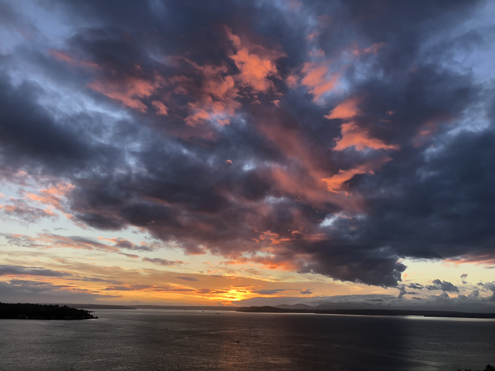

---
# This page uses Hydejack's `about` layout, which shows the primary author's picture and about text at the top.
# You can change it to the regular `page` layout if you want.
layout: about

# The title of the page.
title: Pictures

# Setting `menu` will generate an entry in the sidebar.
menu: true
order: 4
---

{: data-width="1867" data-height="1389"}
Belltown Seattle, Washington
{:.figure}

{: data-width="1867" data-height="1389"}
Kerið, Iceland
{:.figure}

{: data-width="1867" data-height="1389"}
Fjaðrárgljúfur, Iceland
{:.figure}

{: data-width="1867" data-height="1389"}
Old Rag Mountain, Virginia
{:.figure}

{: data-width="1867" data-height="1389"}
Skógafoss, Iceland
{:.figure}

{: data-width="1867" data-height="1389"}
Green Lake Trail - Mount Rainier, Washington
{:.figure}

{: data-width="1867" data-height="1389"}
Mount Rainier, Washington
{:.figure}

{: data-width="1867" data-height="1389"}
Green Lake Trail - Mount Rainier, Washington
{:.figure}

{: data-width="1867" data-height="1389"}
Mount Rainier, Washington
{:.figure}

{: data-width="1867" data-height="1389"}
Capitol Hill Seattle, Washington
{:.figure}

{: data-width="1867" data-height="1389"}
{:.figure}

{: data-width="1867" data-height="1389"}
Alaska
{:.figure}

{: data-width="1867" data-height="1389"}
Gullfoss, Iceland
{:.figure}

{: data-width="1867" data-height="1389"}
Old Rag Mountain, Virginia
{:.figure}

{: data-width="1867" data-height="1389"}
Outer Banks, North Carolina
{:.figure}

{: data-width="1867" data-height="1389"}
Belltown Seattle, Washington
{:.figure}

[blog]: https://hydejack.com/blog/
[portfolio]: https://hydejack.com/projects/
[resume]: https://hydejack.com/resume/
[download]: https://hydejack.com/download/
[welcome]: https://hydejack.com/
[forms]: https://hydejack.com/forms-by-example/

[features]: #features
[news]: #build-an-audience
[syntax]: #syntax-highlighting
[latex]: example/_posts/2018-06-01-example-content-iii.md#math

[lic]: https://hydejack.com/LICENSE/
[pro]: https://hydejack.com/licenses/PRO/
[docs]: https://hydejack.com/docs/

[kit]: https://github.com/qwtel/hy-starter-kit/archive/master.zip
[src]: https://github.com/qwtel/hydejack
[gem]: https://rubygems.org/gems/jekyll-theme-hydejack
[buy]: https://app.simplegoods.co/i/NATYVLYT

[gpss]: https://developers.google.com/speed/pagespeed/insights/?url=https%3A%2F%2Fhydejack.com%2F
[hy-push-state]: https://qwtel.com/hy-push-state/
[hy-drawer]: https://qwtel.com/hy-drawer/
[hy-img]: https://qwtel.com/hy-img/
[rouge]: http://rouge.jneen.net
[katex]: https://khan.github.io/KaTeX/
[tinyletter]: https://tinyletter.com/

*[FLIP]: First-Last-Invert-Play. A coding technique to achieve performant page transition animations.

